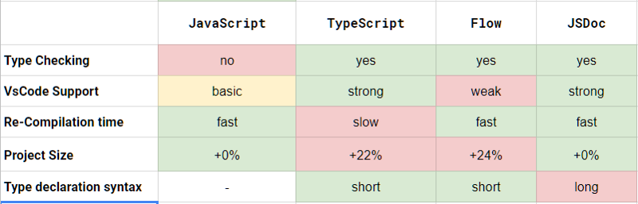
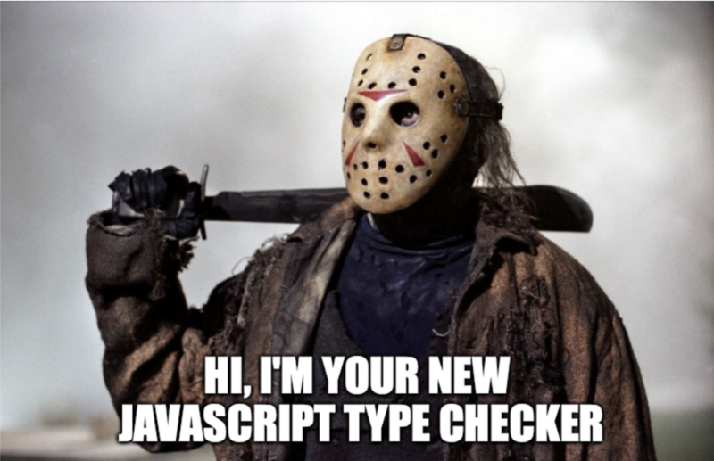
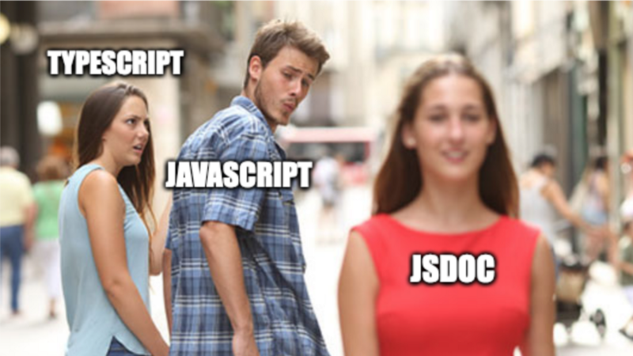

import { Appear, Notes, Head, Code, Image } from "mdx-deck"
import { Split, FullScreenCode } from "mdx-deck/layouts"
import { CodeSurfer } from "mdx-deck-code-surfer"
import prismTheme from "prism-react-renderer/themes/nightOwl"
import okaidia from "react-syntax-highlighter/styles/prism/okaidia"
import { dark } from "mdx-deck/themes"

export const theme = {
  ...dark,
  prism: {
    style: okaidia
  }
}

<Head>
  <title>TypeSafety Using JSDoc</title>
  <link
    rel="stylesheet"
    href="https://use.fontawesome.com/releases/v5.5.0/css/all.css"
    crossorigin="anonymous"
  />
</Head>

Hello 👋

My name is **Subramanya Chakravarthy ([@chakrihacker](https://twitter.com/chakrihacker))**

Created [react-native-safe-mapview](https://github.com/chakrihacker/react-native-safe-mapview) **🌍**

Software Developer **👨‍💻** @CoWrks

---

# TypeSafety Using JSDoc

---

# Why?


---

# Why?

<ul>
  <Appear>
    <li> Early detection of type errors</li>
    <li>Better code analysis </li>
    <li>Improved IDE support</li>
    <li>Improves code readability </li>
    <li>Provides useful IntelliSense while coding</li>
  </Appear>
</ul>

<Notes>
  Few months back everyone in my twitter feed started talking about typescript.
  So With the curiosity I wanted to integrate and try typescript in our react
  native app I went to my VP and told him we should move to typescript. He asked
  me why? I can't say out of curiosity as a reason and went back to know
  reasons. So here are the reasons
</Notes>

---

# Comparison



---

### Getting Types right is hard



```notes
If you have a background in a language with strict typing like Java, C#, etc., the transition will be easy.
If you’re accustomed to a language with dynamic typing, like Python, Ruby or JavaScript, providing types for JavaScript can feel burdensome.
```

---

## JSDoc for types

- It provides type information as comments in JavaScript

---

## Setup VS Code for type checking

Global

```javascript
"javascript.implicitProjectConfig.checkJs": true
```

## Turn on By file

```javascript
// @ts-check
// @ts-nocheck
// @ts-ignore
```

---

### jsconfig.json

If you have jsconfig, you can use checkJs which sets the project to check for types

```javascript
{
    "compilerOptions": {
        "checkJs": true
    },
    "exclude": [
        "node_modules",
        "**/node_modules/*"
    ]
}
```

---

### JSDoc Basics - Type

```javascript
/**
 * @type {string} name A name to use.
 */
let name = "Chakravarthy"
```

```notes
With arrays, you can optionally use a typed array: any[], or string[], or number[], or Object[]
```

---

### Default Types

#### JSDoc provides the following types:

- null
- undefined
- boolean
- number
- string
- Array or []
- Object or {}

```notes
You can have a typed array: any[], number[], string[]. You could also have an array of object types: Employee[].
```

---

##### JSDoc Basics - Union and Intersection Types

```javascript
// Union type:
/**
 * @type {number | string} value The value of the product.
 */
const price = 12 // or '12'

// Intersection type:
/**
 * @type {{name: string}, {age: number}}
 */
const person = {
  name: "Subramanya",
  age: 25
}
```

---

##### Custom Types - @typedef

<!-- ##### Similar to typescript Interface -->

```javascript
/**
 * A person object with a name and age.
 * @typedef {Object<string, any>} Person
 * @property {string} name The name of the person.
 * @property {number} age The age of the person.
 */
/**
 * @type {Person} person
 */
const person = {
  name: "Subramanya",
  age: 25
}
```

```notes
Use @property to define an object’s members.
```

---

### Functions

```javascript
/**
 * A person object with name, age and sayName method.
 * @typedef {Object} Person
 * @property {string} name The person's name.
 * @property {number} age The person's age.
 * @property {Function} sayName A function that alerts the person's name.
 */
const person = {
  name: "Chakravarthy",
  age: 25,
  sayName() {
    alert(this.name)
  }
}
```

---

export default FullScreenCode

```javascript
/**
 * Class to create a person object.
 */
class Person {
  constructor(props) {
    /**
     * @property {string} name The person's name.
     */
    this.name = props.name
    /**
     * @property {number} age The person's name.
     */
    this.age = props.age
    /**
     * @property {Function} sayName A method to annouce the person's name.
     * @returns void
     */
    this.sayName = () => alert(this.name)
  }
}

const guy = new Person({
  name: "Subramanya",
  age: 25
})
guy.sayName()
```

```notes
JsDoc for classes
```

---

### JSDoc Basics - Optional Parameters []

```javascript
/**
 * @typedef {Object} Options The Options to use in the function createUser.
 * @property {string} firstName The user's first name.
 * @property {string} lastName The user's last name.
 * @property {number} [age] The user's age.
 */
/**
 * @type {Options} opts
 */
const opts = { firstName: "Subramanya", lastName: "Chakravarthy", age: 25 }
```

---

### Defining Object Types

In JSDoc usage for types, type Object and object are treated as any

It sounds illegal

That gives you two choices when you need to actually have a Object type, use an object literal or use Object with types

---

export default FullScreenCode

```javascript
// This gets resolved to type `any`.
/**
 * As Object.
 * @type {Object} obj1
 */

// This designates a empty object literal.
// Adding properties will generate a type error.
/**
 * As object literal:
 * @type {{}} obj2
 */

// Define properties in object literal
/**
 * Object literal with properties:
 * @type {{name: string, age: number, job: string}} employee
 */

// Define generic object.
// This can have any number of properties of type any.
/**
 * @type {Object<string, any>} person
 */
```

---

```javascript
// Define generic object.
// This can have any number of properties of type any.
/**
 * @type {Object<string, any>} Member
 * @property {string} name The members's name.
 * @property {number} [age] The members's age.
 * @property {string} [job] The member's job.
 */
/**
 * @type {Member} Jack
 */
const Jack = {
  age: 28
}
```

```notes
Intellisense and best for generic object type
```

---

```javascript
// Define generic object.
// This can have any number of properties of type any.
/**
 * @type {Object<string, any>}
 */
const Jack = {
  age: 28
}
```

```notes
Less IntelliSense
```

---

### Verbosity vs Simplicity

Prefer Verbose over simplicity

```notes
When it comes to how you define your types, it’s best to be more verbose as shown in the previous
example of object types because it will result in richer IntelliSense. But if the code will not
be used by others ever, then simplicity is good enough. Bare in mind that if you use simpler
definitions, and then come back to the code many months later, you may have a harder time sorting
out what the code is doing. Verbose code not only contains type information but documents how the
code works for human readers. It’s best to err on the side of being verbose.
```

---

<!-- prettier-ignore-start -->

### Type Casting

```javascript
// Create a button element.
// Type will be Node.
const btn = document.createElement('button')
// Because type is Node, we cannot call setAttribute,
// since this is on the Element type.
// Performing a type cast from Node to Element fixes this:

/** @type {Element} */(btn).setAttribute('disabled', true)
```

<!-- prettier-ignore-end -->

---

### You can import from another file

```javascript
/**
 * @param {import("react").ChangeEvent<HTMLInputElement>} event
 */
handleChange = event => {
  const { value } = event.target
  this.setState(() => ({ description: value }))
}
```

---

### Avoid Type Any

```javascript
// Union type:
/**
 * @type {number | string} value The value of the product.
 */
const price = 12 // or '12'

// Intersection type:
/**
 * @type {{name: string}, {age: number}}
 */
const person = {
  name: "Subramanya",
  age: 25
}
```

---

### Let's Do Live Coding

---

### Summary



---

### Some resources that helped me to make this presentation

- https://www.typescriptlang.org/docs/handbook/type-checking-javascript-files.html
- https://hackernoon.com/why-i-no-longer-use-typescript-with-react-and-why-you-shouldnt-either-e744d27452b4
- https://medium.com/@martin_hotell/build-100-type-safe-react-apps-in-vanilla-javascript-bd29a8364078
- https://medium.com/@trukrs/type-safe-javascript-with-jsdoc-7a2a63209b76
